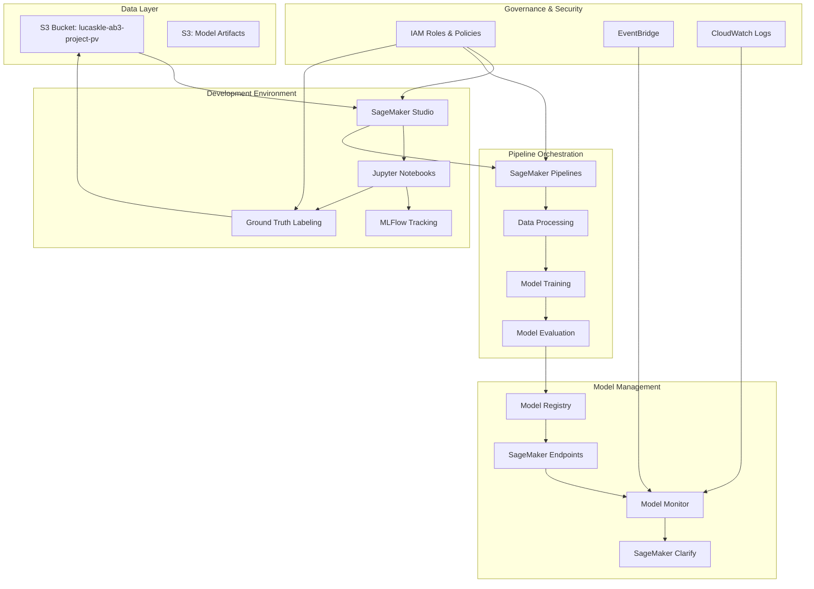
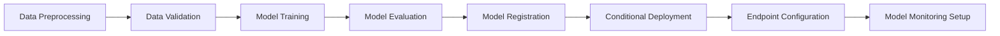
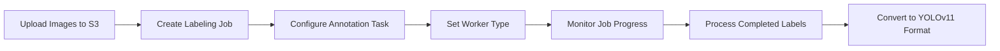

# MLOps SageMaker Demo Design Document

## Overview

This design document outlines the architecture and implementation approach for a comprehensive MLOps demonstration using AWS SageMaker. The solution showcases end-to-end machine learning operations with clear governance, role-based access control, automated pipelines, and comprehensive monitoring using YOLOv11 for object detection on drone imagery.

The architecture emphasizes the separation of concerns between Data Scientists (focused on experimentation and model development) and ML Engineers (focused on operationalization and deployment), while maintaining full traceability and governance throughout the ML lifecycle.

## Architecture

### High-Level Architecture Components



### Role-Based Access Architecture

The system implements strict role separation:

**Data Scientist Role:**
- Read-only access to raw data in S3
- Full access to SageMaker Studio notebooks
- Access to MLFlow for experiment tracking
- No access to production endpoints or deployment resources

**ML Engineer Role:**
- Full access to SageMaker Pipelines
- Access to Model Registry and deployment resources
- Permission to create and manage endpoints
- Access to monitoring and production resources

## Components and Interfaces

### 1. Data Management Layer

**S3 Data Storage:**
- Primary bucket: `lucaskle-ab3-project-pv` (drone imagery dataset)
- Artifacts bucket: Stores model artifacts, preprocessed data, and pipeline outputs
- Versioning enabled for all ML artifacts
- Cross-region replication for disaster recovery

**Data Access Patterns:**
- Data Scientists: Read-only access via SageMaker Studio
- ML Engineers: Read/write access for pipeline artifacts
- Automated pipelines: Programmatic access with service roles

### 2. Development Environment

**SageMaker Studio Configuration:**
- Custom domain with user profiles for each role
- Pre-configured environments with YOLOv11 dependencies
- Integrated MLFlow tracking server
- Git integration for notebook version control

**Jupyter Notebook Structure:**
```
notebooks/
├── data-exploration/
│   ├── dataset-analysis.ipynb
│   └── data-profiling.ipynb
├── model-development/
│   ├── yolov11-training.ipynb
│   ├── hyperparameter-tuning.ipynb
│   └── model-evaluation.ipynb
└── pipeline-development/
    ├── preprocessing-pipeline.ipynb
    └── training-pipeline.ipynb
```

### 3. MLFlow Integration

**Experiment Tracking:**
- Centralized MLFlow server hosted on SageMaker
- Automatic logging of hyperparameters, metrics, and artifacts
- Model versioning and comparison capabilities
- Integration with SageMaker Training Jobs

**MLFlow Components:**
- Tracking Server: Hosted on SageMaker with RDS backend
- Artifact Store: S3 bucket for model artifacts
- Model Registry: Integration with SageMaker Model Registry

### 4. SageMaker Pipeline Architecture

**Pipeline Structure:**


**Pipeline Components:**
- **Data Preprocessing Step:** YOLOv11 data format conversion, augmentation
- **Training Step:** Distributed training with hyperparameter optimization
- **Evaluation Step:** Model performance metrics and validation
- **Registration Step:** Automatic model registry with approval workflow
- **Deployment Step:** Conditional deployment based on performance thresholds

### 5. Ground Truth Labeling Integration

**Labeling Job Configuration:**
- Pre-configured templates for object detection tasks
- Custom labeling workflows for drone imagery annotation
- Integration with SageMaker Studio notebooks
- Automated job status tracking and metrics

**Labeling Workflow:**


**Worker Management:**
- Support for private workforce through Cognito
- Integration with Mechanical Turk for public workforce
- Custom UIs for efficient object detection annotation
- Quality control mechanisms for annotation consistency

**Data Conversion:**
- Automated conversion from Ground Truth output to YOLOv11 format
- Validation of annotation quality and completeness
- Integration with data preprocessing pipeline
- Version tracking for labeled datasets

### 6. Model Monitoring and Governance

**SageMaker Model Monitor:**
- Data quality monitoring for input drift detection
- Model quality monitoring for performance degradation
- Scheduled monitoring jobs with customizable thresholds
- Integration with EventBridge for alerting

**SageMaker Clarify:**
- Bias detection in training data and model predictions
- Feature importance analysis
- Explainability reports for model interpretability

## Data Models

### 1. YOLOv11 Data Structure

```python
# Training Data Format
{
    "images": [
        {
            "id": "image_001",
            "file_path": "s3://bucket/images/drone_001.jpg",
            "width": 1920,
            "height": 1080,
            "annotations": [
                {
                    "bbox": [x, y, width, height],
                    "class_id": 0,
                    "class_name": "vehicle"
                }
            ]
        }
    ],
    "categories": [
        {"id": 0, "name": "vehicle"},
        {"id": 1, "name": "person"},
        {"id": 2, "name": "building"}
    ]
}
```

### 2. MLFlow Experiment Schema

```python
# MLFlow Experiment Structure
{
    "experiment_name": "yolov11-drone-detection",
    "run_id": "unique_run_identifier",
    "parameters": {
        "learning_rate": 0.001,
        "batch_size": 16,
        "epochs": 100,
        "image_size": 640,
        "model_variant": "yolov11n"
    },
    "metrics": {
        "mAP_0.5": 0.85,
        "mAP_0.5:0.95": 0.72,
        "precision": 0.88,
        "recall": 0.82,
        "training_loss": 0.15
    },
    "artifacts": {
        "model_path": "s3://artifacts/models/yolov11_best.pt",
        "config_path": "s3://artifacts/configs/training_config.yaml"
    }
}
```

### 3. Pipeline Execution Metadata

```python
# SageMaker Pipeline Execution
{
    "pipeline_name": "yolov11-training-pipeline",
    "execution_id": "pipeline_execution_id",
    "status": "Succeeded",
    "steps": [
        {
            "step_name": "data-preprocessing",
            "status": "Succeeded",
            "input_artifacts": ["s3://bucket/raw-data/"],
            "output_artifacts": ["s3://bucket/processed-data/"]
        },
        {
            "step_name": "model-training",
            "status": "Succeeded",
            "training_job_name": "yolov11-training-job-001",
            "model_artifacts": "s3://bucket/model-artifacts/"
        }
    ]
}
```

## Error Handling

### 1. Pipeline Error Handling

**Data Processing Errors:**
- Validation checks for data format and quality
- Automatic retry mechanisms for transient failures
- Fallback to previous known good data version
- Detailed error logging with CloudWatch integration

**Training Errors:**
- Checkpoint saving for training resumption
- Resource allocation failure handling
- Hyperparameter validation before training start
- Automatic scaling for resource constraints

**Deployment Errors:**
- Blue/green deployment strategy for zero-downtime updates
- Automatic rollback on deployment failure
- Health check validation before traffic routing
- Circuit breaker pattern for endpoint protection

### 2. Monitoring and Alerting

**EventBridge Integration:**
- Pipeline failure notifications
- Model drift detection alerts
- Resource utilization warnings
- Cost threshold notifications

**Error Recovery Procedures:**
- Automated retry logic with exponential backoff
- Manual intervention triggers for critical failures
- Disaster recovery procedures for data loss scenarios
- Incident response playbooks for production issues

## Testing Strategy

### 1. Unit Testing

**Component Testing:**
- Data preprocessing functions
- Model training utilities
- Pipeline step implementations
- MLFlow integration functions

**Test Coverage:**
- Minimum 80% code coverage requirement
- Automated test execution in CI/CD pipeline
- Mock services for AWS SDK interactions
- Property-based testing for data transformations

### 2. Integration Testing

**Pipeline Testing:**
- End-to-end pipeline execution with sample data
- Cross-service integration validation
- Performance testing under load
- Failure scenario testing

**Environment Testing:**
- Development environment validation
- Staging environment deployment testing
- Production readiness checks
- Security and compliance validation

### 3. Model Testing

**Model Validation:**
- Performance benchmarking against baseline models
- Bias and fairness testing with SageMaker Clarify
- Robustness testing with adversarial examples
- A/B testing framework for model comparison

**Data Quality Testing:**
- Input data validation and schema checking
- Data drift detection and alerting
- Feature importance stability testing
- Model explainability validation

### 4. Governance Testing

**Access Control Testing:**
- Role-based access validation
- Cross-account access restrictions
- API security testing
- Audit trail verification

**Compliance Testing:**
- Data privacy compliance checks
- Model governance workflow validation
- Regulatory requirement adherence
- Documentation completeness verification

## Implementation Considerations

### 1. Cost Optimization

**Resource Management:**
- Spot instances for training jobs where appropriate
- Automatic scaling for inference endpoints
- Scheduled shutdown of development resources
- Cost monitoring and alerting with "ab" profile tagging

### 2. Security

**Data Protection:**
- Encryption at rest and in transit
- VPC isolation for sensitive workloads
- IAM least privilege access principles
- Regular security audits and compliance checks

### 3. Scalability

**Horizontal Scaling:**
- Multi-AZ deployment for high availability
- Auto-scaling groups for compute resources
- Load balancing for inference endpoints
- Distributed training for large datasets

### 4. Monitoring and Observability

**Comprehensive Logging:**
- Structured logging with CloudWatch
- Distributed tracing for pipeline execution
- Performance metrics collection
- Custom dashboards for stakeholder visibility