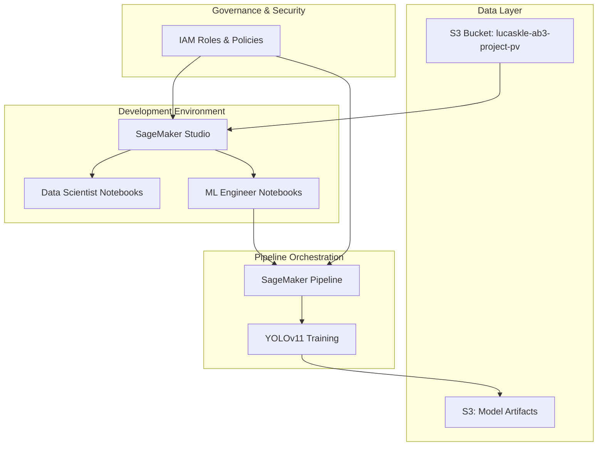
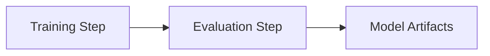

# SageMaker Core Setup Design Document

## Overview

This design document outlines the architecture and implementation approach for setting up the core AWS SageMaker infrastructure for machine learning operations. The solution focuses on creating SageMaker Studio environments for Data Scientists and ML Engineers, along with a pipeline for training YOLOv11 models on drone imagery data stored in an S3 bucket.

The architecture emphasizes simplicity and core functionality, providing a minimal viable setup that can be easily deployed and managed. The design separates concerns between Data Scientists (focused on data exploration and preparation) and ML Engineers (focused on pipeline execution and management).

## Architecture

### High-Level Architecture Components



### Role-Based Access Architecture

The system implements role separation:

**Data Scientist Role:**
- Read-only access to raw data in S3
- Access to SageMaker Studio notebooks for data exploration
- No access to pipeline execution or model deployment

**ML Engineer Role:**
- Full access to SageMaker Pipelines
- Access to training job execution
- Permission to manage model artifacts

## Components and Interfaces

### 1. Data Management Layer

**S3 Data Storage:**
- Primary bucket: `lucaskle-ab3-project-pv` (drone imagery dataset)
- Model artifacts stored in the same bucket under a models/ prefix
- Simple organization with clear prefixes for different data types

**Data Access Patterns:**
- Data Scientists: Read-only access via SageMaker Studio
- ML Engineers: Read/write access for pipeline artifacts
- Automated pipelines: Programmatic access with service roles

### 2. Development Environment

**SageMaker Studio Configuration:**
- Domain with user profiles for each role
- Pre-configured environments with YOLOv11 dependencies
- Simple notebook examples for each role

**Jupyter Notebook Structure:**
```
notebooks/
├── data_scientist_example.ipynb
└── ml_engineer_example.ipynb
```

### 3. SageMaker Pipeline Architecture

**Pipeline Structure:**


**Pipeline Components:**
- **Training Step:** YOLOv11 model training with configurable hyperparameters
- **Evaluation Step:** Basic model performance metrics calculation
- **Artifacts:** Model files stored in S3 bucket

## Data Models

### 1. YOLOv11 Data Structure

```python
# Training Data Format (simplified)
{
    "images": [
        {
            "id": "image_001",
            "file_path": "s3://bucket/images/drone_001.jpg",
            "width": 1920,
            "height": 1080,
            "annotations": [
                {
                    "bbox": [x, y, width, height],
                    "class_id": 0,
                    "class_name": "vehicle"
                }
            ]
        }
    ],
    "categories": [
        {"id": 0, "name": "vehicle"},
        {"id": 1, "name": "person"},
        {"id": 2, "name": "building"}
    ]
}
```

### 2. Pipeline Definition Structure

```python
# SageMaker Pipeline Definition
{
    "pipeline_name": "yolov11-training-pipeline",
    "role_arn": "arn:aws:iam::account-id:role/SageMakerExecutionRole",
    "steps": [
        {
            "name": "TrainingStep",
            "type": "Training",
            "arguments": {
                "input_data": "s3://bucket/data/training",
                "output_model": "s3://bucket/models/yolov11",
                "hyperparameters": {
                    "epochs": "10",
                    "batch-size": "16",
                    "learning-rate": "0.001"
                }
            }
        },
        {
            "name": "EvaluationStep",
            "type": "Processing",
            "arguments": {
                "input_model": "s3://bucket/models/yolov11/model.tar.gz",
                "input_data": "s3://bucket/data/validation",
                "output_evaluation": "s3://bucket/evaluation"
            }
        }
    ]
}
```

## Error Handling

### 1. Deployment Error Handling

**Resource Creation Errors:**
- Validation checks before resource creation
- Clear error messages with troubleshooting guidance
- Idempotent operations to prevent duplicate resources
- Graceful continuation when non-critical components fail

**Access Control Errors:**
- Validation of IAM role existence before user profile creation
- Fallback to default roles if custom roles cannot be created
- Clear documentation of required permissions

### 2. Pipeline Error Handling

**Training Errors:**
- Basic error reporting for training job failures
- Logs accessible through SageMaker Studio
- Simple retry mechanism for transient failures

## Testing Strategy

### 1. Deployment Testing

**Script Testing:**
- Manual validation of deployment script functionality
- Testing in clean AWS environment
- Verification of created resources

### 2. Access Control Testing

**Role-Based Access Testing:**
- Verification of Data Scientist access limitations
- Confirmation of ML Engineer pipeline execution permissions
- Testing of cross-role access restrictions

### 3. Pipeline Testing

**Execution Testing:**
- Verification of pipeline execution with sample data
- Confirmation of model artifact creation
- Basic validation of training job functionality

## Implementation Considerations

### 1. Cost Optimization

**Resource Management:**
- Use of cost-effective instance types for training
- No persistent resources beyond SageMaker domain and S3 storage
- Clear cleanup procedures to prevent ongoing charges

### 2. Security

**Data Protection:**
- Basic encryption for data at rest in S3
- IAM role-based access control
- Least privilege principle for all roles
- Exclusive use of "ab" AWS profile for all AWS operations

### 3. Simplicity

**Focused Implementation:**
- Minimal components to achieve core functionality
- Clear separation of concerns between roles
- Simple notebook examples with step-by-step instructions
- Streamlined deployment process

### 4. Deployment Process

**Setup Workflow:**
1. Verify "ab" AWS profile is configured and accessible
2. Create IAM roles for Data Scientists and ML Engineers using the "ab" profile
3. Create SageMaker domain and user profiles using the "ab" profile
4. Create example notebooks for each role
5. Define and register SageMaker Pipeline using the "ab" profile
6. Provide access instructions to users

**Cleanup Workflow:**
1. Verify "ab" AWS profile is configured and accessible
2. Delete SageMaker user profiles using the "ab" profile
3. Delete SageMaker domain using the "ab" profile
4. Delete IAM roles using the "ab" profile
5. Optionally delete S3 data (with confirmation) using the "ab" profile