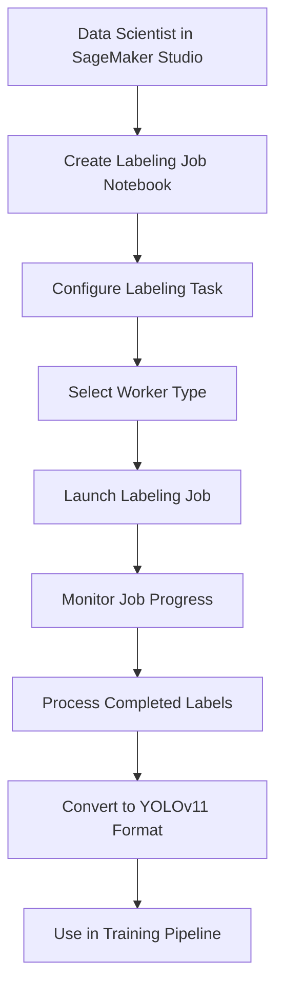

# SageMaker Ground Truth Labeling Integration

This steering document provides guidance for implementing SageMaker Ground Truth labeling jobs within the MLOps SageMaker Demo project, focusing on enabling Data Scientists to easily create and manage labeling jobs from Jupyter notebooks in SageMaker Studio.

## Ground Truth Integration Architecture

The Ground Truth labeling integration follows this workflow:



## Key Components

### 1. Labeling Job Creation
- Jupyter notebook templates for creating object detection labeling jobs
- Pre-configured task templates optimized for drone imagery annotation
- Integration with S3 for input/output data management
- Cost estimation and budget controls

### 2. Worker Management
- Support for private workforce through Cognito user pools
- Integration with Mechanical Turk for public workforce
- Custom labeling UIs for efficient object detection annotation
- Worker performance metrics and quality control

### 3. Job Monitoring
- Real-time job status tracking
- Completion metrics and progress visualization
- Cost monitoring and budget alerts
- Quality assessment of annotations

### 4. Data Processing
- Automated conversion from Ground Truth output format to YOLOv11 format
- Validation of annotation quality and completeness
- Integration with data preprocessing pipeline
- Version tracking for labeled datasets

## Implementation Approach

### 1. Notebook Templates
Create reusable Jupyter notebook templates that Data Scientists can use to:
- Select images for labeling from S3
- Configure object detection labeling tasks
- Set up worker pools and instructions
- Launch and monitor labeling jobs
- Process and validate completed annotations

### 2. Python Utilities
Develop a Python module (`ground_truth_utils.py`) with functions for:
- Creating labeling job configurations
- Monitoring job status and progress
- Converting Ground Truth output to YOLOv11 format
- Validating annotation quality
- Estimating and tracking costs

### 3. IAM Configuration
Update IAM roles to include permissions for:
- Creating and managing Ground Truth labeling jobs
- Accessing S3 for input/output data
- Managing private workforces (if applicable)
- Monitoring job status and metrics

### 4. Integration with MLOps Pipeline
Ensure labeled data can be seamlessly integrated into:
- Data preprocessing steps
- Training pipelines
- Model evaluation workflows
- Version control and tracking systems

## Best Practices

### 1. Cost Management
- Implement budget controls and cost estimation before job creation
- Use private workforces for sensitive data
- Optimize batch sizes and worker assignments
- Monitor costs in real-time with alerts for budget thresholds

### 2. Quality Control
- Provide clear labeling instructions with examples
- Implement consensus labeling for critical datasets
- Use automated validation for annotation consistency
- Create feedback loops for improving annotation quality

### 3. Security and Governance
- Ensure proper access controls for labeling jobs
- Implement data encryption for sensitive images
- Track data lineage from raw images to labeled datasets
- Document all labeling job configurations and results

### 4. Efficiency
- Use pre-annotation with existing models when possible
- Implement active learning to prioritize images for labeling
- Create custom UIs optimized for drone imagery annotation
- Batch similar images for consistent labeling

## Reference Links

- [SageMaker Ground Truth Documentation](https://docs.aws.amazon.com/sagemaker/latest/dg/sms.html)
- [Ground Truth Object Detection Task Type](https://docs.aws.amazon.com/sagemaker/latest/dg/sms-bounding-box.html)
- [Creating Labeling Jobs](https://docs.aws.amazon.com/sagemaker/latest/dg/sms-create-labeling-job.html)
- [Custom Labeling Workflows](https://docs.aws.amazon.com/sagemaker/latest/dg/sms-custom-templates.html)

## Implementation Examples

### Example: Creating a Ground Truth Labeling Job

```python
import boto3
from datetime import datetime
from src.data.ground_truth_utils import create_labeling_job_config

# Configure the labeling job
job_name = f"drone-detection-{datetime.now().strftime('%Y-%m-%d-%H-%M-%S')}"
s3_input_path = "s3://lucaskle-ab3-project-pv/raw-images/"
s3_output_path = "s3://lucaskle-ab3-project-pv/labeled-data/"

# Create labeling job configuration
labeling_job_config = create_labeling_job_config(
    job_name=job_name,
    input_path=s3_input_path,
    output_path=s3_output_path,
    task_type="BoundingBox",
    worker_type="private",
    labels=["drone", "vehicle", "person", "building"],
    instructions="Label all drones and other objects visible in the image.",
    max_budget_usd=100.00
)

# Create the labeling job
sagemaker_client = boto3.client('sagemaker', region_name='us-east-1')
response = sagemaker_client.create_labeling_job(**labeling_job_config)

print(f"Created labeling job: {job_name}")
print(f"Job ARN: {response['LabelingJobArn']}")
```

### Example: Converting Ground Truth Output to YOLOv11 Format

```python
from src.data.ground_truth_utils import convert_ground_truth_to_yolo

# Convert Ground Truth output to YOLOv11 format
input_manifest = "s3://lucaskle-ab3-project-pv/labeled-data/output/manifest.json"
output_directory = "s3://lucaskle-ab3-project-pv/training-data/yolo-format/"

# Perform conversion
convert_ground_truth_to_yolo(
    input_manifest=input_manifest,
    output_directory=output_directory,
    class_mapping={
        "drone": 0,
        "vehicle": 1,
        "person": 2,
        "building": 3
    }
)

print(f"Converted annotations saved to: {output_directory}")
```

## Integration with Existing MLOps Workflow

The Ground Truth labeling capability integrates with the existing MLOps workflow:

1. **Data Exploration**: Data Scientists identify images requiring annotation
2. **Labeling**: Create and run Ground Truth labeling jobs
3. **Preprocessing**: Convert labeled data to YOLOv11 format
4. **Training**: Use labeled data in model training
5. **Evaluation**: Assess model performance on labeled test sets
6. **Deployment**: Deploy models trained on labeled data
7. **Monitoring**: Track model performance on new data

This integration enables a complete data labeling and model development cycle within the SageMaker Studio environment, allowing Data Scientists to efficiently create high-quality training datasets for YOLOv11 object detection models.