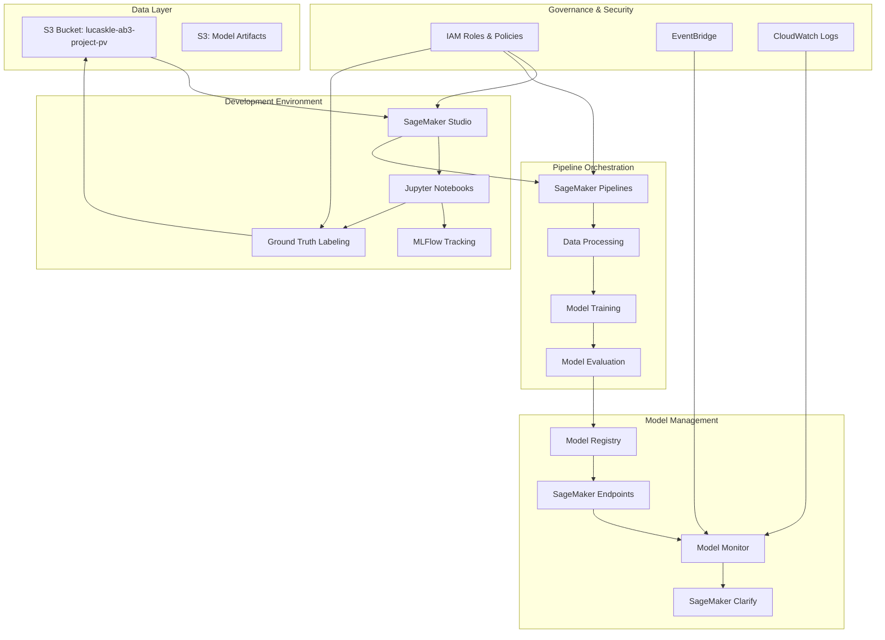
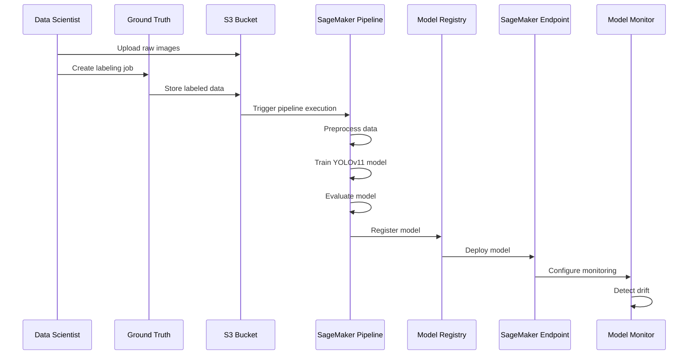
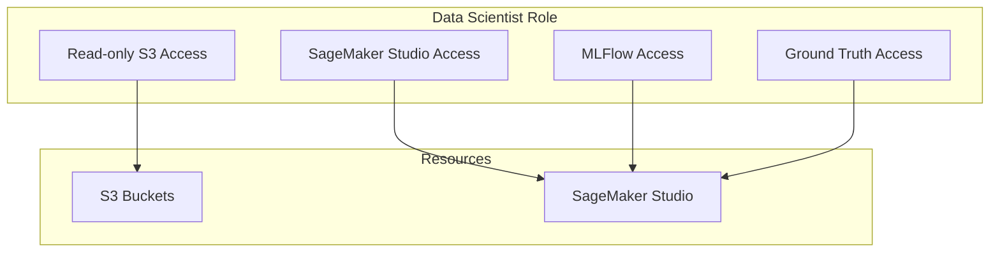
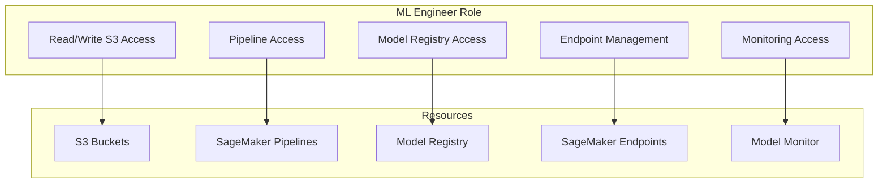
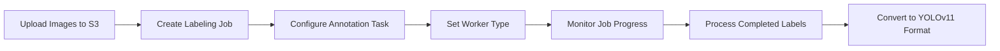
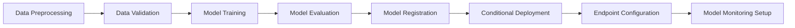

# MLOps SageMaker Demo

A comprehensive MLOps demonstration using AWS SageMaker for YOLOv11 object detection on drone imagery, with governance, monitoring, and pipeline orchestration. This project follows the [AWS SageMaker MLOps reference implementation](https://github.com/aws-samples/amazon-sagemaker-from-idea-to-production) with enhancements for computer vision workloads.

## Architecture Overview

This project implements a complete machine learning lifecycle from data ingestion to model deployment, with clear role separation between Data Scientists and ML Engineers, following AWS best practices for MLOps.



## Key Features

- **Data Management**: S3-based data access with validation and comprehensive image profiling
- **Data Profiling**: Advanced drone imagery analysis with quality metrics, recommendations, and visualization
- **Data Labeling**: Ground Truth integration for efficient dataset creation with automated YOLO format conversion
- **Model Development**: YOLOv11 implementation for drone detection
- **Pipeline Orchestration**: SageMaker Pipelines for automated workflows
- **Experiment Tracking**: MLFlow integration for model versioning
- **Monitoring**: Model performance and data drift monitoring
- **Governance**: IAM role-based access control for different team roles
- **Cost Optimization**: Resource tagging, spot instances, and auto-scaling

## MLOps Workflow

This project follows the six-step process outlined in the [AWS SageMaker MLOps reference implementation](https://github.com/aws-samples/amazon-sagemaker-from-idea-to-production):

1. **Experiment in a notebook** - Initial development and experimentation with YOLOv11 for drone imagery
2. **Scale with SageMaker processing jobs and Python SDK** - Moving computation to SageMaker for data preprocessing
3. **Operationalize with ML pipeline and model registry** - Building automation with SageMaker Pipelines
4. **Add a model building CI/CD pipeline** - Automating the model building process
5. **Add a model deployment pipeline** - Automating model deployment with conditional steps
6. **Add model and data monitoring** - Ensuring ongoing quality with Model Monitor and EventBridge alerts



## Project Structure

```
├── configs/                 # Configuration files and infrastructure
│   ├── project_config.py    # Centralized project configuration
│   ├── environment_config.py # Environment-specific configuration
│   ├── cdk/                 # AWS CDK infrastructure code
│   └── environments/        # Environment-specific configurations
├── docs/                    # Comprehensive documentation
│   ├── architecture/        # Architecture diagrams and descriptions
│   ├── user-guides/         # Role-specific user guides
│   └── workflows/           # MLOps workflow documentation
├── examples/                # Example code and usage patterns
│   ├── data-labeling/       # Ground Truth labeling examples
│   ├── model-training/      # YOLOv11 training examples
│   └── pipeline/            # Pipeline orchestration examples
├── notebooks/               # Jupyter notebooks for development
│   ├── data-exploration/    # Data analysis and profiling notebooks
│   ├── data-labeling/       # Ground Truth labeling notebooks
│   ├── model-development/   # Model training and experimentation
│   └── pipeline-development/ # Pipeline development notebooks
├── scripts/                 # Utility and setup scripts
│   ├── setup/               # Environment and AWS setup scripts
│   ├── preprocessing/       # Data preprocessing scripts
│   ├── training/            # Training execution scripts
│   └── monitoring/          # Monitoring and alerting scripts
├── src/                     # Source code modules
│   ├── data/                # Data processing and validation
│   ├── models/              # Model implementation modules
│   ├── pipeline/            # Pipeline orchestration modules
│   │   ├── components/      # Pipeline component classes
│   │   ├── templates/       # Script templates for pipeline steps
│   │   ├── script_templates.py # Template manager for generating scripts
│   │   └── ...              # Other pipeline modules
│   └── monitoring/          # Monitoring and observability modules
├── tests/                   # Unit and integration tests
├── mlruns/                  # Local MLFlow tracking data
└── logs/                    # Application logs
```

## Setup Instructions

### Prerequisites

- AWS account with appropriate permissions
- AWS CLI configured with "ab" profile
- Python 3.10+
- Docker (for local development)

### Environment Setup

1. Clone the repository:
```bash
git clone https://github.com/yourusername/mlops-sagemaker-demo.git
cd mlops-sagemaker-demo
```

2. Create and activate a virtual environment:
```bash
python -m venv venv
source venv/bin/activate  # On Windows: venv\Scripts\activate
```

3. Install dependencies:
```bash
pip install -r requirements.txt
```

4. Configure AWS CLI with "ab" profile:
```bash
./scripts/setup/configure_aws.sh
```

5. Deploy IAM roles and policies:
```bash
./scripts/setup/deploy_iam_roles.sh
```

6. Validate the IAM setup:
```bash
python scripts/setup/validate_iam_roles.py --profile ab
```

7. Deploy CDK infrastructure:
```bash
cd configs/cdk
npm install
cdk deploy --profile ab
cd ../..
```

## Governance and Role-Based Access Control

This project implements strict role separation through IAM roles and policies:

### Data Scientist Role

- Read-only access to raw data in S3
- Full access to SageMaker Studio notebooks
- Access to MLFlow for experiment tracking
- Permissions to create Ground Truth labeling jobs
- No access to production resources



### ML Engineer Role

- Full access to SageMaker Pipelines
- Access to Model Registry and deployment resources
- Permission to create and manage endpoints
- Access to monitoring and production resources



## Usage Guides

### Data Scientists

1. **Data Exploration**: Use notebooks in `notebooks/data-exploration/` to analyze the drone imagery dataset.
   - Utilize the `DroneImageryProfiler` to analyze image characteristics, quality metrics, and get recommendations
   - Generate comprehensive profile reports with resolution, brightness, contrast, sharpness, and color diversity metrics
2. **Data Labeling**: Create and manage Ground Truth labeling jobs using notebooks in `notebooks/data-labeling/`.
3. **Model Development**: Experiment with YOLOv11 models using notebooks in `notebooks/model-development/`.

For detailed instructions, see the [Data Scientist Guide](docs/user-guides/data_scientist_guide.md).

### ML Engineers

1. **Pipeline Development**: Create and modify SageMaker Pipelines using code in `src/pipeline/`.
2. **Model Deployment**: Deploy models to endpoints using the deployment scripts.
3. **Monitoring Setup**: Configure model monitoring using the monitoring modules.

For detailed instructions, see the [ML Engineer Guide](docs/user-guides/ml_engineer_guide.md).

## Data Profiling and Analysis

The project includes a comprehensive `DroneImageryProfiler` for analyzing drone imagery datasets:

```python
from src.data.data_profiler import DroneImageryProfiler
from src.data.s3_utils import S3DataAccess

# Initialize S3 access and profiler
s3_access = S3DataAccess(bucket_name="lucaskle-ab3-project-pv", profile_name="ab")
profiler = DroneImageryProfiler(s3_access)

# Profile images (with optional sampling)
image_keys = s3_access.list_objects(prefix="raw-images/")
profile_data = profiler.profile_images(image_keys, sample_size=100)

# Generate human-readable report
report = profiler.generate_profile_report(profile_data)
print(report)

# Get data quality recommendations
recommendations = profiler.get_recommendations(profile_data)
for rec in recommendations:
    print(f"- {rec}")
```

The profiler analyzes:
- Image dimensions and aspect ratios
- File sizes and formats
- Color modes and diversity
- Brightness, contrast, and sharpness
- Quality metrics and error rates

Based on the analysis, it provides actionable recommendations for data preprocessing and model training optimization.

## Ground Truth Labeling Workflow

The project includes a comprehensive workflow for creating and managing SageMaker Ground Truth labeling jobs:



To create a labeling job:

```bash
# Run the Ground Truth example script
python examples/data-labeling/ground_truth_example.py --bucket lucaskle-ab3-project-pv --prefix raw-images
```

For more detailed control, use the interactive Jupyter notebook in `notebooks/data-labeling/create_labeling_job_interactive.ipynb`.

## SageMaker Pipeline Implementation

The project implements a comprehensive SageMaker Pipeline for YOLOv11 training and deployment:



### Template-Based Script Generation

The pipeline uses a file-based template system for generating processing scripts. Templates are stored in the `src/pipeline/templates/` directory and loaded dynamically by the `ScriptTemplateManager`:

```python
from src.pipeline.script_templates import script_template_manager

# Generate a preprocessing script with custom logic
preprocessing_script = script_template_manager.generate_preprocessing_script(
    preprocessing_logic="""
    # Custom preprocessing logic for YOLOv11 format
    import cv2
    from glob import glob
    
    # Process images and annotations
    image_files = glob(os.path.join(input_path, "*.jpg"))
    for image_file in image_files:
        # Process each image
        img = cv2.imread(image_file)
        # Apply preprocessing transformations
        # ...
    """,
    additional_args='parser.add_argument("--image-size", type=int, default=640)',
    kwargs_extraction='"image_size": args.image_size'
)
```

This approach allows for flexible script generation while maintaining consistent structure and error handling.

To execute the pipeline:

```python
from src.pipeline.sagemaker_pipeline_factory import PipelineFactory

# Create pipeline factory
factory = PipelineFactory(aws_profile="ab", region="us-east-1")

# Create complete pipeline
pipeline = factory.create_complete_pipeline(
    pipeline_name="yolov11-training-pipeline",
    preprocessing_script="scripts/preprocessing/preprocess_yolo_data.py",
    training_script="scripts/training/train_yolov11.py",
    evaluation_script="scripts/training/evaluate_model.py",
    input_data="s3://lucaskle-ab3-project-pv/raw-data/",
    model_name="yolov11-drone-detection",
    instance_type_training="ml.g4dn.xlarge"
)

# Execute pipeline
execution = factory.execute_pipeline(pipeline)
```

## Model Monitoring and Drift Detection

The project implements comprehensive model monitoring using SageMaker Model Monitor:

- **Data Quality Monitoring**: Detect drift in input data distributions
- **Model Quality Monitoring**: Track model performance metrics over time
- **Bias Monitoring**: Detect bias in model predictions using SageMaker Clarify
- **Feature Attribution Drift**: Monitor changes in feature importance

To set up monitoring:

```python
from src.pipeline.model_monitor import setup_model_monitoring

# Set up model monitoring
setup_model_monitoring(
    endpoint_name="yolov11-endpoint",
    baseline_dataset="s3://lucaskle-ab3-project-pv/baseline-data/",
    monitoring_schedule_name="yolov11-monitoring-schedule"
)
```

## Cost Optimization

This project implements several cost optimization strategies:

1. **Spot Instances**: Use spot instances for training jobs to reduce costs by up to 90%
2. **Auto-scaling**: Configure auto-scaling for inference endpoints to match demand
3. **Resource Scheduling**: Automatically shut down development resources when not in use
4. **Cost Monitoring**: Track costs using the "ab" AWS CLI profile and Cost Explorer

```python
# Example of spot instance configuration for training
from sagemaker.estimator import EstimatorBase

estimator = EstimatorBase(
    role="SageMakerRole",
    instance_count=1,
    instance_type="ml.g4dn.xlarge",
    use_spot_instances=True,  # Enable spot instances
    max_wait=36000,  # Maximum time to wait for spot instances
    max_run=3600,    # Maximum training time
)
```

For detailed cost monitoring, use the cost tracking functions in `scripts/monitoring/cost_tracking.py`.

## Testing and Validation

The project includes comprehensive unit and integration tests for all components:

```bash
# Run all tests
python -m unittest discover tests

# Run specific test file
python -m unittest tests/test_data_profiler.py
```

Key test modules include:
- `test_data_profiler.py`: Tests for the DroneImageryProfiler class
- `test_yolo_preprocessor.py`: Tests for YOLO data preprocessing
- `test_ground_truth_utils.py`: Tests for Ground Truth integration
- `test_model_monitor.py`: Tests for model monitoring functionality
- `test_drift_detection.py`: Tests for data drift detection
- `test_pipeline_integration.py`: End-to-end tests for SageMaker Pipeline functionality

### Pipeline Integration Testing

The project includes comprehensive integration tests for the SageMaker Pipeline implementation in `tests/test_pipeline_integration.py`. These tests validate:

1. **End-to-End Pipeline Execution**: Tests the complete pipeline workflow from creation to execution
2. **Component Integration**: Verifies proper integration between preprocessing, training, and evaluation steps
3. **Custom Pipeline Components**: Tests the ability to create pipelines with custom component configurations
4. **Error Handling**: Validates pipeline error detection and reporting
5. **MLFlow Integration**: Tests integration between SageMaker Pipelines and MLFlow tracking

The tests use mocking to simulate AWS services, allowing for comprehensive testing without actual AWS resource creation:

```python
# Example of pipeline integration test
def test_pipeline_component_integration(self):
    """Test integration between pipeline components"""
    # Create pipeline factory
    factory = SageMakerPipelineFactory(
        aws_profile="ab",
        region="us-east-1",
        config=self.config
    )
    
    # Create preprocessing step
    preprocessing_step = factory.create_preprocessing_step(
        input_data="s3://test-bucket/input-data"
    )
    
    # Create training step
    training_step = factory.create_training_step(
        preprocessed_data=preprocessing_step.get_output()
    )
    
    # Create evaluation step
    evaluation_step = factory.create_evaluation_step(
        model=training_step.get_model(),
        test_data=preprocessing_step.get_test_data_output()
    )
    
    # Verify step dependencies
    self.assertEqual(training_step.get_dependencies()[0], preprocessing_step.get_step())
    self.assertEqual(evaluation_step.get_dependencies()[0], training_step.get_step())
```

These tests ensure that the pipeline components work together correctly and that the pipeline can handle various configurations and error conditions.

## Cleanup Procedures

To avoid ongoing costs, run the cleanup script when you're done:

```bash
./scripts/setup/cleanup_resources.sh
```

This script will:

1. Delete all SageMaker endpoints
2. Terminate all SageMaker notebook instances
3. Stop all SageMaker training jobs
4. Delete all SageMaker models
5. Delete all CloudWatch alarms
6. Delete all EventBridge rules
7. Delete all CloudFormation stacks

Before running the cleanup script, verify that you want to delete all resources by running:

```bash
./scripts/setup/validate_cleanup.sh
```

## AWS Documentation References

For more information on the AWS services used in this project, refer to the following documentation:

- [Implement MLOps with SageMaker](https://docs.aws.amazon.com/sagemaker/latest/dg/mlops.html)
- [SageMaker Model Monitor](https://docs.aws.amazon.com/sagemaker/latest/dg/model-monitor-mlops.html)
- [SageMaker Ground Truth](https://docs.aws.amazon.com/sagemaker/latest/dg/sms.html)
- [SageMaker Pipelines](https://docs.aws.amazon.com/sagemaker/latest/dg/pipelines.html)
- [SageMaker MLOps Project Templates](https://docs.aws.amazon.com/sagemaker/latest/dg/sagemaker-projects-templates.html)

## Contributing

Please see [CONTRIBUTING.md](CONTRIBUTING.md) for details on our code of conduct and the process for submitting pull requests.

## License

This project is licensed under the MIT License - see the [LICENSE](LICENSE) file for details.

## Acknowledgments

- AWS SageMaker team for their [MLOps reference implementation](https://github.com/aws-samples/amazon-sagemaker-from-idea-to-production)
- Ultralytics for the YOLOv11 object detection framework