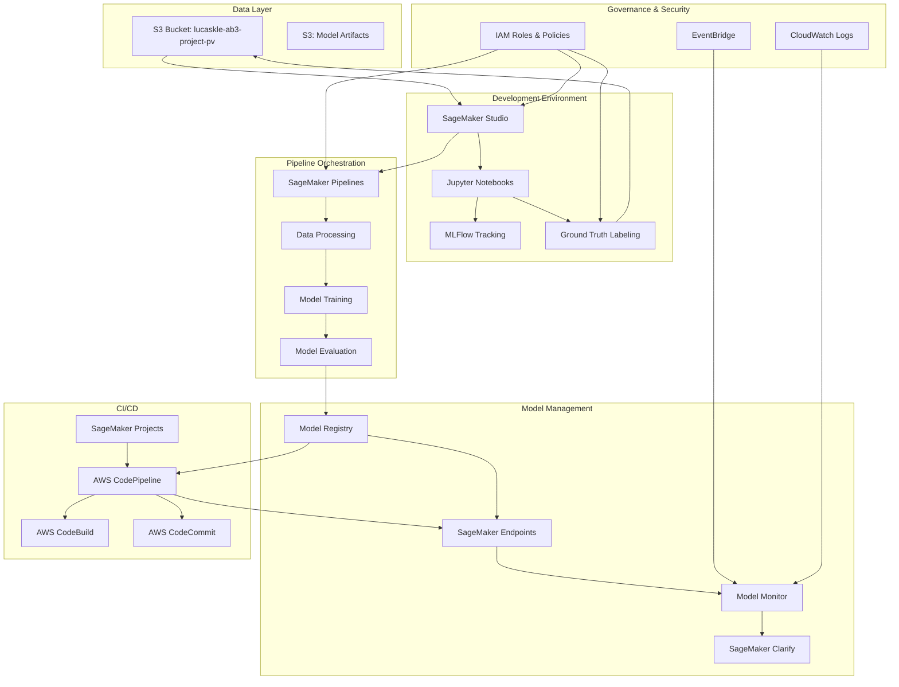
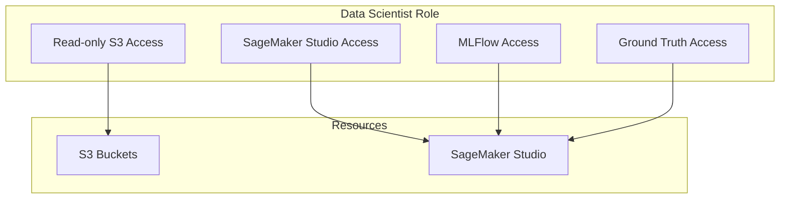
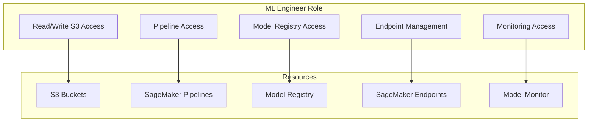

# MLOps SageMaker Demo

A comprehensive MLOps demonstration using AWS SageMaker for YOLOv11 object detection on drone imagery, with governance, monitoring, and pipeline orchestration. This project follows the [AWS SageMaker MLOps reference implementation](https://github.com/aws-samples/amazon-sagemaker-from-idea-to-production) with enhancements for computer vision workloads.

## Architecture Overview

This project implements a complete machine learning lifecycle from data ingestion to model deployment, with clear role separation between Data Scientists and ML Engineers, following AWS best practices for MLOps.



## Key Features

- **Data Management**: S3-based data access with validation and comprehensive image profiling
- **Data Profiling**: Advanced drone imagery analysis with quality metrics, recommendations, and visualization
- **Data Labeling**: Ground Truth integration for efficient dataset creation with automated YOLO format conversion
- **Model Development**: YOLOv11 implementation for drone detection
- **Pipeline Orchestration**: SageMaker Pipelines for automated workflows
- **Experiment Tracking**: MLflow integration with SageMaker managed tracking server for model versioning
- **Monitoring**: Model performance and data drift monitoring
- **Governance**: IAM role-based access control for different team roles
- **Cost Optimization**: Resource tagging, spot instances, and auto-scaling
- **CI/CD Integration**: SageMaker Projects with CodePipeline for automated model building and deployment

## MLOps Workflow

This project follows the six-step process outlined in the [AWS SageMaker MLOps reference implementation](https://github.com/aws-samples/amazon-sagemaker-from-idea-to-production):

1. **Experiment in a notebook** - Initial development and experimentation with YOLOv11 for drone imagery
2. **Scale with SageMaker processing jobs and Python SDK** - Moving computation to SageMaker for data preprocessing
3. **Operationalize with ML pipeline and model registry** - Building automation with SageMaker Pipelines
4. **Add a model building CI/CD pipeline** - Automating the model building process
5. **Add a model deployment pipeline** - Automating model deployment with conditional steps
6. **Add model and data monitoring** - Ensuring ongoing quality with Model Monitor and EventBridge alerts

### Infrastructure Deployment

The project includes multiple deployment options to suit different needs:

#### Core SageMaker Setup (New)

For a minimal viable setup focused on core SageMaker functionality, use the core deployment script:

```bash
./scripts/setup/deploy_core_sagemaker.sh --profile ab
```

This script will:
- Verify the AWS "ab" profile is configured correctly
- Deploy IAM roles for Data Scientists and ML Engineers
- Create a SageMaker domain with appropriate user profiles
- Set up S3 bucket directories for notebooks and data
- Provide access instructions for SageMaker Studio

The core setup focuses on:
- SageMaker Studio access for Data Scientists and ML Engineers
- Role-based access control with appropriate permissions
- Access to the drone imagery data in S3
- Basic infrastructure for YOLOv11 model training
- Core notebook deployment for immediate productivity

**Complete Core Setup Workflow:**

1. Deploy core infrastructure: `./scripts/setup/deploy_core_sagemaker.sh --profile ab`
2. Deploy core notebooks: `python scripts/setup/deploy_notebooks_to_studio.py --profile ab`
3. Access SageMaker Studio and follow the generated instructions in `SAGEMAKER_STUDIO_INSTRUCTIONS.md`
4. Use role-specific core notebooks for immediate productivity

Options for the core setup:
```bash
./scripts/setup/deploy_core_sagemaker.sh --help
```

Key parameters:
- `--profile`: AWS CLI profile to use (default: ab)
- `--region`: AWS region (default: us-east-1)
- `--project-name`: Project name (default: sagemaker-core-setup)
- `--data-bucket`: Data bucket name (default: lucaskle-ab3-project-pv)
- `--skip-validation`: Skip validation steps
- `--skip-stack-wait`: Skip waiting for CloudFormation stack updates

##### Deploying Core Notebooks to SageMaker Studio

After setting up the core SageMaker infrastructure, you can deploy the core notebooks to SageMaker Studio:

```bash
python scripts/setup/deploy_notebooks_to_studio.py --profile ab
```

This script will:
- Upload core notebooks to S3 with timestamped organization
- Create deployment scripts for SageMaker Studio
- Generate role-specific README files with usage instructions
- Create comprehensive user instructions for accessing notebooks

The deployment includes:
- **Data Scientist Notebooks**: `data-scientist-core-enhanced.ipynb` with MLflow integration for data exploration and preparation
- **ML Engineer Notebooks**: `ml-engineer-core-enhanced.ipynb` with MLflow and Model Registry integration for pipeline management

After running the deployment script, you'll get:
- Generated deployment script: `scripts/setup/deploy_studio_notebooks.sh`
- User instructions: `SAGEMAKER_STUDIO_INSTRUCTIONS.md`
- Role-specific README files: `notebooks/README_data-scientist.md` and `notebooks/README_ml-engineer.md`

##### Accessing Notebooks in SageMaker Studio

To access the deployed notebooks in SageMaker Studio:

1. **Open SageMaker Studio** in your browser
2. **Open a terminal** in SageMaker Studio
3. **Download notebooks** using the provided commands:

```bash
# For Data Scientists:
mkdir -p ~/data-scientist-notebooks
aws s3 cp s3://lucaskle-ab3-project-pv/sagemaker-studio-notebooks/[timestamp]/data-scientist/data-scientist-core-enhanced.ipynb ~/data-scientist-notebooks/ --profile ab

# For ML Engineers:
mkdir -p ~/ml-engineer-notebooks
aws s3 cp s3://lucaskle-ab3-project-pv/sagemaker-studio-notebooks/[timestamp]/ml-engineer/ml-engineer-core-enhanced.ipynb ~/ml-engineer-notebooks/ --profile ab
```

4. **Navigate** to the appropriate directory in the SageMaker Studio file browser
5. **Open** the notebook for your role

Alternatively, you can use the generated deployment script:
```bash
./scripts/setup/deploy_studio_notebooks.sh
```

Or the simple copy script for quick access:
```bash
./scripts/setup/copy_notebooks_to_studio.sh
```

To validate the core setup after deployment:
```bash
python scripts/setup/validate_core_sagemaker.py --profile ab
```

To clean up the core setup when no longer needed:
```bash
./scripts/setup/cleanup_core_sagemaker.sh --profile ab
```

#### Complete Infrastructure Deployment

For a comprehensive MLOps environment, use the complete infrastructure deployment script:

```bash
./scripts/setup/deploy_complete_infrastructure.sh --email your.email@example.com
```

This script will automatically check for and use the Python interpreter from the `venv` virtual environment if available, otherwise it will fall back to using the system's Python3.

This script will:
- Configure AWS CLI with the "ab" profile
- Deploy IAM roles and policies with robust error handling
- Deploy CDK stacks for endpoints and other resources with fallback options (like using default inline Lambda code)
- Set up MLflow on SageMaker with managed tracking server
- Set up SageMaker Projects for CI/CD
- Deploy a model to a SageMaker endpoint
- Configure model monitoring and SageMaker Clarify
- Set up EventBridge rules and SNS notifications
- Configure cost monitoring and budgets
- Validate the deployment with graceful handling of errors and missing validation scripts

You can customize the deployment with various options:

```bash
./scripts/setup/deploy_complete_infrastructure.sh --help
```

The script supports additional options for more flexible deployments:

- `--skip-aws-config`: Skip the AWS CLI configuration prompt (useful for automated deployments)
- `--skip-stack-wait`: Skip waiting for CloudFormation stack updates (speeds up deployment significantly)
- `--skip-validation`: Skip validation steps for faster deployment
- `--skip-monitoring`: Skip model monitoring setup
- `--skip-mlflow`: Skip MLFlow setup
- `--skip-eventbridge`: Skip EventBridge setup
- `--skip-cost-monitoring`: Skip cost monitoring setup

For example, to deploy quickly without waiting for stack updates or AWS configuration prompts:

```bash
./scripts/setup/deploy_complete_infrastructure.sh --profile ab --skip-aws-config --skip-stack-wait
```

This will significantly speed up the deployment process by not waiting for CloudFormation stack updates to complete before proceeding to the next steps.

#### Option 3: Step-by-Step Manual Setup

If you prefer to set up components individually:

1. Configure AWS CLI with "ab" profile:
```bash
./scripts/setup/configure_aws.sh
```

2. Deploy IAM roles and policies:
```bash
./scripts/setup/deploy_iam_roles.sh
```

   The script includes error handling that allows the process to continue even when non-critical errors occur, such as when no updates are needed for an existing stack. The script now supports the `--skip-wait` flag to skip waiting for CloudFormation stack updates, which can speed up deployment.

3. Validate the IAM setup (if the validation script exists):
```bash
venv/bin/python scripts/setup/validate_iam_roles.py --profile ab
```

   The script will display the command being executed and then run the validation.

4. Deploy CDK infrastructure:
```bash
./scripts/setup/deploy_cdk.sh --profile ab
```

This script will:
- Load project configuration using the virtual environment Python if available
- Install CDK dependencies if needed
- Check for Lambda code and use default inline code if not found (improved error handling)
- Synthesize the CDK stack to check for errors before deployment
- Deploy the stack with the necessary parameters
- Update the project configuration with the Lambda function ARN

   The script now includes improved error handling that allows deployment to continue even when Lambda code is not found at the specified path, using default inline Lambda code instead.

   You can also use the `--skip-wait` option to skip waiting for CloudFormation stack updates, which can speed up the deployment process significantly.

5. Set up SageMaker Projects for CI/CD:
```bash
venv/bin/python scripts/setup/setup_sagemaker_project.py --profile ab
```

## Setup Instructions

### Prerequisites

- AWS account with appropriate permissions
- AWS CLI configured with "ab" profile
- Python 3.10+
- Docker (for local development)

### Dependencies

The project uses a simplified set of core dependencies:
- boto3 (≥1.28.0): AWS SDK for Python
- sagemaker (≥2.190.0): Amazon SageMaker Python SDK
- pandas (≥2.0.0): Data manipulation and analysis
- matplotlib (≥3.7.0) & seaborn (≥0.12.0): Data visualization
- numpy (≥1.24.0): Numerical computing
- PyYAML (≥6.0) & xmltodict (≥0.13.0): Configuration and data parsing

### Environment Setup

1. Clone the repository:
```bash
git clone https://github.com/yourusername/mlops-sagemaker-demo.git
cd mlops-sagemaker-demo
```

2. Create and activate a virtual environment:
```bash
python -m venv venv
source venv/bin/activate  # On Windows: venv\Scripts\activate
```

3. Install dependencies:
```bash
pip install -r requirements.txt
```

> **Note:** The setup and deployment scripts automatically check for a virtual environment named `venv` in the project root directory. The scripts will use the Python interpreter from this environment if available, otherwise they will fall back to using the system's Python3.

## Governance and Role-Based Access Control

This project implements strict role separation through IAM roles and policies:

### Data Scientist Role

- Read-only access to raw data in S3
- Full access to SageMaker Studio notebooks
- Access to MLFlow for experiment tracking
- Permissions to create Ground Truth labeling jobs
- No access to production resources



### ML Engineer Role

- Full access to SageMaker Pipelines
- Access to Model Registry and deployment resources
- Permission to create and manage endpoints
- Access to monitoring and production resources



## Core Notebooks

The project includes role-specific core notebooks that provide essential functionality for each user type:

### Data Scientist Core Notebook

**`notebooks/data-scientist-core-enhanced.ipynb`**

This notebook provides comprehensive data exploration and preparation capabilities with MLFlow integration:

- **Data Exploration**: Analyze drone imagery datasets with S3 integration
- **Image Analysis**: Basic image characteristics analysis (dimensions, file sizes, formats)
- **Data Visualization**: Sample image display and dataset statistics
- **MLFlow Tracking**: Complete experiment tracking for all data exploration activities
- **Data Preparation**: Prepare data structure for YOLOv11 training
- **Ground Truth Integration**: Create SageMaker Ground Truth labeling jobs
- **Input Manifest Creation**: Generate manifest files for labeling jobs

Key features:
- AWS profile integration with "ab" profile
- S3 data access and exploration
- MLFlow experiment tracking for reproducibility
- Interactive data visualization
- Ground Truth labeling job configuration
- YOLO dataset structure preparation

### ML Engineer Core Notebook

**`notebooks/ml-engineer-core-enhanced.ipynb`**

This notebook provides training pipeline execution and management with MLFlow and Model Registry integration:

- **Pipeline Configuration**: Set up YOLOv11 training pipeline parameters
- **Pipeline Execution**: Execute SageMaker training jobs with MLFlow tracking
- **Pipeline Monitoring**: Monitor training progress and results in real-time
- **Model Registry**: Automatic model registration in SageMaker Model Registry
- **Experiment Management**: View and compare MLFlow experiments and runs
- **Model Approval**: Manage model approval workflows for production deployment

Key features:
- Dataset discovery and validation
- SageMaker training job creation and execution
- MLFlow experiment and run management
- Model Registry integration with approval workflows
- Training job monitoring and status tracking
- Model artifact management and versioning

## Usage Guides

### Data Scientists

1. **Core Workflow**: Start with `notebooks/data-scientist-core-enhanced.ipynb` for essential data exploration and preparation tasks.
2. **Advanced Data Exploration**: Use notebooks in `notebooks/data-exploration/` to analyze the drone imagery dataset.
   - Utilize the `DroneImageryProfiler` to analyze image characteristics, quality metrics, and get recommendations
   - Generate comprehensive profile reports with resolution, brightness, contrast, sharpness, and color diversity metrics
3. **Data Labeling**: Create and manage Ground Truth labeling jobs using notebooks in `notebooks/data-labeling/`.
4. **Model Development**: Experiment with YOLOv11 models using notebooks in `notebooks/model-development/`.

For detailed instructions, see the [Data Scientist Guide](docs/user-guides/data_scientist_guide.md).

### ML Engineers

1. **Core Workflow**: Start with `notebooks/ml-engineer-core-enhanced.ipynb` for essential pipeline execution and model management tasks.
2. **Pipeline Development**: Create and modify SageMaker Pipelines using code in `src/pipeline/`.
3. **Model Deployment**: Deploy models to endpoints using the deployment scripts.
4. **Monitoring Setup**: Configure model monitoring using the monitoring modules.
5. **CI/CD Management**: Manage SageMaker Projects and CI/CD pipelines for automated model building and deployment.

For detailed instructions, see the [ML Engineer Guide](docs/user-guides/ml_engineer_guide.md).

## Cleanup Procedures

To avoid ongoing costs, use the appropriate cleanup script when you're done:

### Core SageMaker Setup Cleanup

```bash
./scripts/setup/cleanup_core_sagemaker.sh --profile ab
```

This script will:
1. Delete SageMaker user profiles
2. Delete SageMaker domain
3. Optionally delete the IAM roles CloudFormation stack

### Complete Infrastructure Cleanup

```bash
./scripts/setup/cleanup_resources.sh --profile ab
```

This script will:
1. Delete all SageMaker endpoints
2. Terminate all SageMaker notebook instances
3. Stop all SageMaker training jobs
4. Delete all SageMaker models
5. Delete all CloudWatch alarms
6. Delete all EventBridge rules
7. Delete all CloudFormation stacks
8. Delete all CodePipeline pipelines
9. Delete all CodeBuild projects
10. Delete all CodeCommit repositories

You can customize the cleanup with various options:

```bash
./scripts/setup/cleanup_resources.sh --help
```

## Project Structure

```
├── configs/                 # Configuration files and infrastructure
│   ├── project_config.py    # Centralized project configuration
│   ├── environment_config.py # Environment-specific configuration
│   ├── cdk/                 # AWS CDK infrastructure code
│   ├── sagemaker_projects/  # SageMaker Projects templates and seed code
│   │   ├── templates/       # CloudFormation templates for SageMaker Projects
│   │   └── seed_code/       # Seed code for model building and deployment
│   └── environments/        # Environment-specific configurations
├── docs/                    # Comprehensive documentation
│   ├── architecture/        # Architecture diagrams and descriptions
│   ├── user-guides/         # Role-specific user guides
│   └── workflows/           # MLOps workflow documentation
├── examples/                # Example code and usage patterns
│   ├── data-labeling/       # Ground Truth labeling examples
│   ├── model-training/      # YOLOv11 training examples
│   └── pipeline/            # Pipeline orchestration examples
├── notebooks/               # Jupyter notebooks for development
│   ├── data-scientist-core-enhanced.ipynb # Core Data Scientist notebook with MLFlow (NEW)
│   ├── ml-engineer-core-enhanced.ipynb # Core ML Engineer notebook with MLFlow and Model Registry (NEW)
│   ├── README_data-scientist.md # Generated Data Scientist notebook guide (NEW)
│   ├── README_ml-engineer.md # Generated ML Engineer notebook guide (NEW)
│   ├── data-exploration/    # Data analysis and profiling notebooks
│   ├── data-labeling/       # Ground Truth labeling notebooks
│   ├── model-development/   # Model training and experimentation
│   └── pipeline-development/ # Pipeline development notebooks
├── scripts/                 # Utility and setup scripts
│   ├── setup/               # Environment and AWS setup scripts
│   │   ├── deploy_core_sagemaker.sh # Core SageMaker setup script (NEW)
│   │   ├── deploy_notebooks_to_studio.py # Deploy core notebooks to SageMaker Studio (NEW)
│   │   ├── deploy_studio_notebooks.sh # Generated notebook deployment script (NEW)
│   │   ├── copy_notebooks_to_studio.sh # Simple notebook copy script (NEW)
│   │   ├── cleanup_core_sagemaker.sh # Core SageMaker cleanup script (NEW)
│   │   ├── validate_core_sagemaker.py # Core SageMaker validation script (NEW)
│   │   ├── deploy_complete_infrastructure.sh # Complete infrastructure setup
│   │   ├── cleanup_resources.sh # Resource cleanup script
│   │   └── ...              # Other setup scripts
│   ├── preprocessing/       # Data preprocessing scripts
│   ├── training/            # Training execution scripts
│   ├── deployment/          # Model deployment scripts
│   └── monitoring/          # Monitoring and alerting scripts
├── src/                     # Source code modules
│   ├── data/                # Data processing and validation
│   ├── models/              # Model implementation modules
│   ├── pipeline/            # Pipeline orchestration modules
│   │   ├── components/      # Pipeline component classes
│   │   ├── templates/       # Script templates for pipeline steps
│   │   ├── script_templates.py # Template manager for generating scripts
│   │   └── ...              # Other pipeline modules
│   └── monitoring/          # Monitoring and observability modules
├── tests/                   # Unit and integration tests
├── mlruns/                  # Local MLFlow tracking data
├── logs/                    # Application logs
├── SAGEMAKER_STUDIO_INSTRUCTIONS.md # Generated SageMaker Studio access instructions (NEW)
└── DEPLOYMENT_SUMMARY.md   # Deployment summary and status
```

## Contributing

Contributions are welcome! Please feel free to submit a Pull Request.

## License

This project is licensed under the MIT License - see the LICENSE file for details.