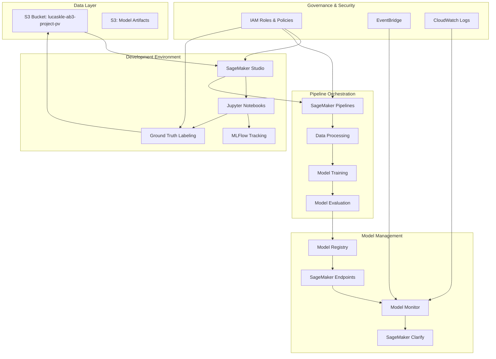

# MLOps SageMaker Demo

A comprehensive MLOps demonstration using AWS SageMaker for YOLOv11 object detection on drone imagery, with governance, monitoring, and pipeline orchestration.

## Architecture Overview

This project implements a complete machine learning lifecycle from data ingestion to model deployment, with clear role separation between Data Scientists and ML Engineers.



## Key Features

- **Data Management**: S3-based data access with validation and profiling
- **Model Development**: YOLOv11 implementation for drone detection
- **Pipeline Orchestration**: SageMaker Pipelines for automated workflows
- **Experiment Tracking**: MLFlow integration for model versioning
- **Monitoring**: Model performance and data drift monitoring
- **Governance**: IAM role-based access control for different team roles
- **Data Labeling**: Ground Truth integration for efficient dataset creation

## Project Structure

```
├── configs/                 # Configuration files and infrastructure
│   ├── project_config.py    # Centralized project configuration
│   ├── environment_config.py # Environment-specific configuration
│   ├── cdk/                 # AWS CDK infrastructure code
│   └── environments/        # Environment-specific configurations
├── docs/                    # Comprehensive documentation
│   ├── architecture/        # Architecture diagrams and descriptions
│   ├── user-guides/         # Role-specific user guides
│   └── workflows/           # MLOps workflow documentation
├── examples/                # Example code and usage patterns
│   ├── data-labeling/       # Ground Truth labeling examples
│   ├── model-training/      # YOLOv11 training examples
│   └── pipeline/            # Pipeline orchestration examples
├── notebooks/               # Jupyter notebooks for development
│   ├── data-exploration/    # Data analysis and profiling notebooks
│   ├── data-labeling/       # Ground Truth labeling notebooks
│   ├── model-development/   # Model training and experimentation
│   └── pipeline-development/ # Pipeline development notebooks
├── scripts/                 # Utility and setup scripts
│   ├── setup/               # Environment and AWS setup scripts
│   ├── preprocessing/       # Data preprocessing scripts
│   ├── training/            # Training execution scripts
│   └── monitoring/          # Monitoring and alerting scripts
├── src/                     # Source code modules
│   ├── data/                # Data processing and validation
│   ├── models/              # Model implementation modules
│   ├── pipeline/            # Pipeline orchestration modules
│   └── monitoring/          # Monitoring and observability modules
├── tests/                   # Unit and integration tests
├── mlruns/                  # Local MLFlow tracking data
└── logs/                    # Application logs
```

## Setup Instructions

### Prerequisites

- AWS account with appropriate permissions
- AWS CLI configured with "ab" profile
- Python 3.10+
- Docker (for local development)

### Environment Setup

1. Clone the repository:
```bash
git clone https://github.com/yourusername/mlops-sagemaker-demo.git
cd mlops-sagemaker-demo
```

2. Create and activate a virtual environment:
```bash
python -m venv venv
source venv/bin/activate  # On Windows: venv\Scripts\activate
```

3. Install dependencies:
```bash
pip install -r requirements.txt
```

4. Configure AWS CLI with "ab" profile:
```bash
./scripts/setup/configure_aws.sh
```

5. Deploy IAM roles and policies:
```bash
./scripts/setup/deploy_iam_roles.sh
```

### Role-Based Access

This project implements strict role separation:

#### Data Scientist Role
- Read-only access to raw data in S3
- Full access to SageMaker Studio notebooks
- Access to MLFlow for experiment tracking
- Permissions to create Ground Truth labeling jobs

#### ML Engineer Role
- Full access to SageMaker Pipelines
- Access to Model Registry and deployment resources
- Permission to create and manage endpoints
- Access to monitoring and production resources

## Usage Guides

### Data Scientists

1. **Data Exploration**: Use notebooks in `notebooks/data-exploration/` to analyze the drone imagery dataset.
2. **Data Labeling**: Create and manage Ground Truth labeling jobs using notebooks in `notebooks/data-labeling/`.
3. **Model Development**: Experiment with YOLOv11 models using notebooks in `notebooks/model-development/`.

### ML Engineers

1. **Pipeline Development**: Create and modify SageMaker Pipelines using code in `src/pipeline/`.
2. **Model Deployment**: Deploy models to endpoints using the deployment scripts.
3. **Monitoring Setup**: Configure model monitoring using the monitoring modules.

## MLOps Workflow

1. **Data Preparation**: Explore and profile the drone imagery dataset
2. **Data Labeling**: Create Ground Truth labeling jobs for object detection
3. **Model Development**: Train YOLOv11 models with experiment tracking
4. **Pipeline Orchestration**: Automate the ML workflow with SageMaker Pipelines
5. **Model Deployment**: Deploy models to SageMaker endpoints
6. **Monitoring**: Set up drift detection and performance monitoring

## Cost Management

All AWS resources are tagged with the "ab" profile for cost allocation. To minimize costs:

- Use spot instances for training jobs where appropriate
- Implement auto-scaling for inference endpoints
- Schedule shutdown of development resources when not in use
- Follow the cleanup procedures when resources are no longer needed

## Cleanup Procedures

To avoid ongoing costs, run the cleanup script when you're done:

```bash
./scripts/setup/cleanup_resources.sh
```

This will terminate all AWS resources created by this project.

## Contributing

Please see [CONTRIBUTING.md](CONTRIBUTING.md) for details on our code of conduct and the process for submitting pull requests.

## License

This project is licensed under the MIT License - see the [LICENSE](LICENSE) file for details.

## Acknowledgments

- AWS SageMaker team for their [MLOps reference implementation](https://github.com/aws-samples/amazon-sagemaker-from-idea-to-production)
- Ultralytics for the YOLOv11 object detection framework