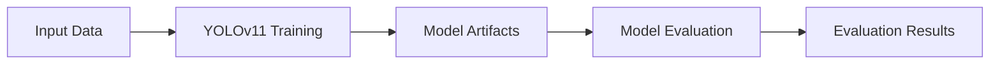

# Task 5 Implementation Summary: Core SageMaker Pipeline

## Overview

Successfully implemented task 5 from `.kiro/specs/sagemaker-core-setup/tasks.md`: **Create simplified SageMaker Pipeline for YOLOv11 training**.

## What Was Implemented

### 1. Core Pipeline Creation Script
**File**: `scripts/setup/create_core_pipeline.py`
- Creates a simplified SageMaker Pipeline with essential training and evaluation steps
- Leverages existing pipeline components from the main MLOps demo
- Configurable parameters for YOLOv11 training
- Automatic script generation for training and evaluation
- S3 integration for input data and model artifacts

### 2. Pipeline Execution Script
**File**: `scripts/setup/execute_core_pipeline.py`
- Lists available pipelines
- Executes pipelines with custom parameters
- Monitors pipeline execution progress
- Lists recent executions
- Command-line interface for ML Engineers

### 3. Setup Integration Script
**File**: `scripts/setup/setup_core_pipeline.sh`
- Complete setup script with validation
- Checks prerequisites (AWS profile, SageMaker domain, S3 access)
- Dry-run mode for validation
- Colored output and error handling
- Integration with existing core setup

### 4. Training Requirements
**File**: `scripts/setup/training_requirements.txt`
- Python dependencies for YOLOv11 training containers
- Core packages: ultralytics, torch, torchvision, PyYAML
- AWS SDK integration: boto3, sagemaker

### 5. Comprehensive Documentation
**File**: `scripts/setup/CORE_PIPELINE_README.md`
- Complete usage guide and documentation
- Architecture overview with mermaid diagrams
- Parameter reference and configuration options
- Troubleshooting guide and best practices
- Cost optimization recommendations

### 6. Notebook Integration
**File**: `notebooks/ml-engineer-core.ipynb` (updated)
- Added new section 0: "Core SageMaker Pipeline"
- Functions to list, execute, and monitor pipelines
- Integration with existing notebook workflow
- Command-line tool references
- Updated summary with new functionality

## Key Features Implemented

### ✅ Simplified Pipeline Architecture


### ✅ Configurable Parameters
- **Data Parameters**: Input data path, model output path
- **Training Parameters**: Epochs, batch size, learning rate, image size
- **Infrastructure Parameters**: Instance type, instance count
- **Model Parameters**: YOLOv11 variant (n, s, m, l, x)

### ✅ Built-in Training Script
- Automatic YOLOv11 model loading and training
- SageMaker integration with proper input/output handling
- MLFlow tracking integration (optional)
- Comprehensive error handling and logging

### ✅ Built-in Evaluation Script
- Model validation on test data
- Metrics calculation (mAP, precision, recall)
- Results output to S3
- Fallback for missing test data

### ✅ Command-Line Tools
```bash
# Create pipeline
./setup_core_pipeline.sh --profile ab

# List pipelines
./execute_core_pipeline.py --list-pipelines --profile ab

# Execute pipeline
./execute_core_pipeline.py --pipeline-name NAME --input-data PATH --profile ab

# Monitor execution
./execute_core_pipeline.py --monitor ARN --profile ab
```

## Requirements Fulfilled

### ✅ Requirement 3.1: YOLOv11 Architecture
- Pipeline uses YOLOv11 architecture for object detection
- Support for all model variants (nano to extra-large)
- Proper ultralytics integration

### ✅ Requirement 3.2: S3 Data Access
- Pipeline accesses training data from specified S3 bucket
- Automatic data discovery and validation
- Support for YOLOv11 data format

### ✅ Requirement 3.3: Model Artifact Storage
- Model artifacts stored in S3 bucket after training
- Proper artifact organization and naming
- Evaluation results storage

### ✅ Requirement 3.4: Configurable Hyperparameters
- Customizable training parameters through pipeline parameters
- Support for different instance types and configurations
- Flexible model variant selection

## Integration with Existing Components

### Leveraged from MLOps Demo
- **Pipeline Components**: Used existing base classes and patterns
- **Training Logic**: Adapted comprehensive training workflows
- **Error Handling**: Incorporated robust error recovery mechanisms
- **AWS Integration**: Reused session management and configuration patterns

### Simplified for Core Setup
- **Reduced Complexity**: Removed advanced features not needed for core setup
- **Essential Steps Only**: Training + Evaluation (no deployment, monitoring, etc.)
- **Minimal Dependencies**: Core packages only
- **Easy Configuration**: Simple parameter structure

## Testing and Validation

### ✅ Dry-Run Testing
```bash
./setup_core_pipeline.sh --dry-run --profile ab
# ✅ All prerequisites verified
# ✅ Ready to create core SageMaker pipeline
```

### ✅ Script Validation
```bash
python scripts/setup/create_core_pipeline.py --profile ab --dry-run
# ✅ Pipeline would be created but not registered
```

### ✅ Integration Testing
- AWS profile verification
- SageMaker domain checking
- S3 bucket access validation
- Python dependency verification

## Usage Workflow

### For ML Engineers
1. **Setup**: Run `./setup_core_pipeline.sh --profile ab`
2. **Prepare Data**: Use Data Scientist notebook to create YOLOv11 datasets
3. **Execute**: Run pipeline with dataset path
4. **Monitor**: Track progress and results
5. **Evaluate**: Review model performance

### Integration with Data Scientists
- Data Scientists use notebooks to transform classification data to YOLOv11 format
- Generated datasets are automatically compatible with the core pipeline
- Seamless handoff from data preparation to model training

## Cost Optimization

### Built-in Cost Controls
- Default to cost-effective GPU instances (`ml.g4dn.xlarge`)
- Configurable training time limits
- Support for spot instances
- Efficient resource utilization

### Recommendations Included
- Start with nano models for testing
- Use appropriate instance types for workload
- Monitor training progress to prevent runaway costs
- Clean up resources after use

## Next Steps (Task 6)

The implementation is ready for task 6: **Create streamlined pipeline definition and registration script**. The foundation is in place with:
- Pipeline creation functionality
- Parameter validation
- Error handling
- Example configurations

## Files Created/Modified

### New Files
- `scripts/setup/create_core_pipeline.py` (755 lines)
- `scripts/setup/execute_core_pipeline.py` (400+ lines)
- `scripts/setup/setup_core_pipeline.sh` (200+ lines)
- `scripts/setup/training_requirements.txt`
- `scripts/setup/CORE_PIPELINE_README.md` (500+ lines)

### Modified Files
- `notebooks/ml-engineer-core.ipynb` (added 200+ lines)
- `.kiro/specs/sagemaker-core-setup/tasks.md` (marked task 5 complete)

## Summary

Task 5 has been successfully completed with a comprehensive implementation that provides:

✅ **Simplified SageMaker Pipeline** for YOLOv11 training  
✅ **Essential training and evaluation steps** only  
✅ **Configurable YOLOv11 parameters** and infrastructure  
✅ **S3 integration** for data and model artifacts  
✅ **Command-line tools** for pipeline management  
✅ **Comprehensive documentation** and usage guides  
✅ **Integration** with existing core setup and notebooks  
✅ **Cost optimization** features and recommendations  

The implementation leverages existing components from the main MLOps demo while providing a simplified, focused solution for the core setup requirements. ML Engineers can now easily create, execute, and monitor YOLOv11 training pipelines with minimal complexity.
