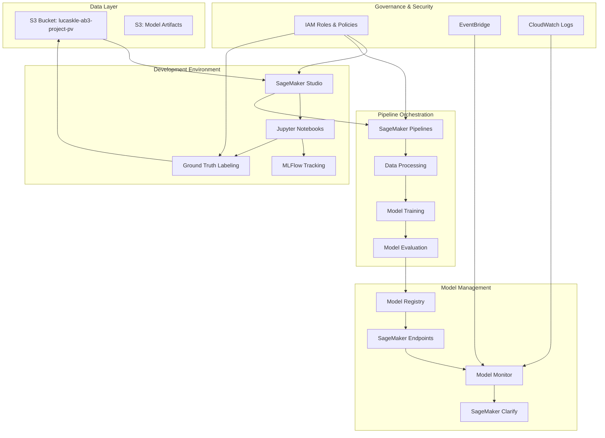
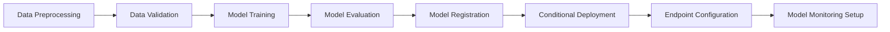
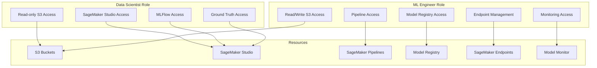
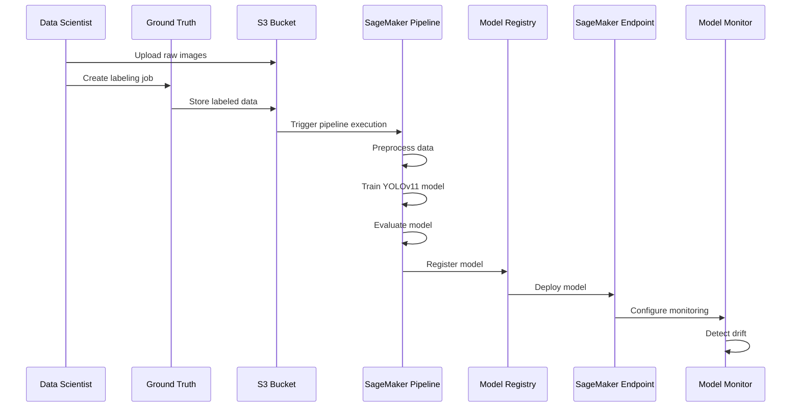
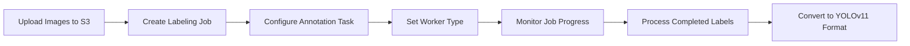
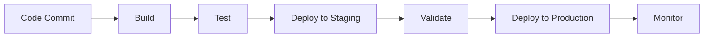

# MLOps Architecture

This document describes the architecture of the MLOps SageMaker Demo project, focusing on the key components and their interactions.

## High-Level Architecture

The MLOps architecture follows the AWS reference implementation for MLOps with SageMaker, with enhancements for YOLOv11 object detection on drone imagery.



## Component Details

### 1. Data Layer

The data layer consists of S3 buckets for storing raw data, processed data, and model artifacts.

**S3 Bucket Structure:**
```
lucaskle-ab3-project-pv/
├── raw-images/                # Raw drone imagery
├── labeled-data/              # Ground Truth labeled data
├── processed-data/            # Preprocessed data for training
├── model-artifacts/           # Model artifacts from training
├── monitoring/                # Model monitoring data
└── ground-truth-jobs/         # Ground Truth job artifacts
```

### 2. Development Environment

The development environment is based on SageMaker Studio, providing Jupyter notebooks for data scientists and ML engineers.

**SageMaker Studio Components:**
- User profiles for Data Scientists and ML Engineers
- Jupyter notebooks for experimentation and development
- MLFlow integration for experiment tracking
- Ground Truth integration for data labeling

### 3. Pipeline Orchestration

SageMaker Pipelines are used to orchestrate the ML workflow, from data preprocessing to model deployment.

**Pipeline Steps:**


### 4. Model Management

Model management includes model registry, deployment, and monitoring.

**Model Registry:**
- Version tracking for models
- Approval workflow for production deployment
- Lineage tracking for model artifacts

**Model Deployment:**
- Auto-scaling endpoints for inference
- Blue/green deployment for zero-downtime updates
- A/B testing for model comparison

**Model Monitoring:**
- Data quality monitoring for drift detection
- Model quality monitoring for performance degradation
- Automated alerts for drift detection

### 5. Governance & Security

Governance and security are implemented through IAM roles, policies, and audit logging.

**Role-Based Access Control:**


## Data Flow

The data flow through the MLOps pipeline follows these steps:

1. **Data Ingestion**: Raw drone imagery is stored in the S3 bucket
2. **Data Labeling**: Ground Truth is used to label the images
3. **Data Preprocessing**: Images are preprocessed for YOLOv11 training
4. **Model Training**: YOLOv11 models are trained with experiment tracking
5. **Model Evaluation**: Models are evaluated against validation data
6. **Model Registration**: Approved models are registered in the Model Registry
7. **Model Deployment**: Models are deployed to SageMaker endpoints
8. **Model Monitoring**: Deployed models are monitored for drift



## Infrastructure as Code

The infrastructure is defined using AWS CDK with TypeScript, enabling version-controlled infrastructure deployment.

**CDK Stack Structure:**
```
configs/cdk/
├── bin/
│   └── app.ts                 # CDK app entry point
└── lib/
    ├── iam-stack.ts           # IAM roles and policies
    └── endpoint-stack.ts      # SageMaker endpoint configuration
```

## Monitoring and Observability

Monitoring and observability are implemented using SageMaker Model Monitor, CloudWatch, and EventBridge.

**Monitoring Components:**
- Data quality monitoring for input drift detection
- Model quality monitoring for performance degradation
- CloudWatch dashboards for visualization
- EventBridge rules for alerting

## Ground Truth Integration

Ground Truth is integrated for efficient data labeling, with custom workflows for drone imagery annotation.

**Labeling Workflow:**


## Deployment Strategy

The deployment strategy follows a CI/CD approach with automated testing and validation.

**Deployment Pipeline:**


## Cost Optimization

Cost optimization is implemented through resource tagging, spot instances, and auto-scaling.

**Cost Optimization Strategies:**
- Use spot instances for training jobs
- Implement auto-scaling for inference endpoints
- Schedule shutdown of development resources
- Monitor costs with the "ab" profile tagging