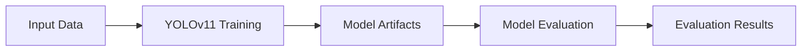

# Core SageMaker Pipeline for YOLOv11 Training

This directory contains scripts for creating and managing a simplified SageMaker Pipeline for YOLOv11 model training in the core setup.

## Overview

The core pipeline provides essential functionality for training YOLOv11 models with minimal complexity:

- **Training Step**: Trains YOLOv11 models using PyTorch on SageMaker
- **Evaluation Step**: Evaluates trained models and generates metrics
- **Simplified Configuration**: Easy-to-use parameters and settings
- **S3 Integration**: Seamless integration with S3 for data and model storage

## Files

### Scripts

- **`create_core_pipeline.py`**: Creates and registers the SageMaker Pipeline
- **`execute_core_pipeline.py`**: Executes and monitors pipeline runs
- **`setup_core_pipeline.sh`**: Complete setup script with validation

### Configuration

- **`training_requirements.txt`**: Python dependencies for training containers
- **`CORE_PIPELINE_README.md`**: This documentation file

## Quick Start

### 1. Setup Pipeline

```bash
# Create the pipeline with default settings
./setup_core_pipeline.sh

# Or with custom options
./setup_core_pipeline.sh --pipeline-name my-yolov11-pipeline --profile ab
```

### 2. List Available Pipelines

```bash
./execute_core_pipeline.py --list-pipelines --profile ab
```

### 3. Execute Pipeline

```bash
# Execute with default parameters
./execute_core_pipeline.py --pipeline-name PIPELINE_NAME --profile ab

# Execute with custom parameters
./execute_core_pipeline.py \
    --pipeline-name PIPELINE_NAME \
    --input-data s3://lucaskle-ab3-project-pv/datasets/my_dataset/ \
    --epochs 20 \
    --batch-size 32 \
    --learning-rate 0.001 \
    --instance-type ml.g4dn.xlarge \
    --model-variant yolov11s \
    --profile ab
```

### 4. Monitor Execution

```bash
# List recent executions
./execute_core_pipeline.py --list-executions PIPELINE_NAME --profile ab

# Monitor specific execution
./execute_core_pipeline.py --monitor EXECUTION_ARN --profile ab
```

## Pipeline Architecture



### Training Step

- **Framework**: PyTorch with Ultralytics YOLOv11
- **Instance Types**: GPU instances (ml.g4dn.xlarge, ml.p3.2xlarge)
- **Input**: YOLOv11 formatted dataset from S3
- **Output**: Trained model artifacts (best.pt, results.json)

### Evaluation Step

- **Framework**: SKLearn processor with YOLOv11 validation
- **Instance Type**: CPU instance (ml.m5.large)
- **Input**: Trained model + validation dataset
- **Output**: Evaluation metrics (mAP, precision, recall)

## Parameters

### Pipeline Parameters

| Parameter | Type | Default | Description |
|-----------|------|---------|-------------|
| `InputData` | String | `s3://bucket/datasets/` | S3 path to training data |
| `ModelOutput` | String | `s3://bucket/models/` | S3 path for model artifacts |
| `TrainingInstanceType` | String | `ml.g4dn.xlarge` | Training instance type |
| `TrainingInstanceCount` | Integer | `1` | Number of training instances |
| `Epochs` | Integer | `10` | Number of training epochs |
| `BatchSize` | Integer | `16` | Training batch size |
| `LearningRate` | Float | `0.001` | Learning rate |
| `ImageSize` | Integer | `640` | Input image size |
| `ModelVariant` | String | `yolov11n` | YOLOv11 model variant |

### YOLOv11 Model Variants

- **yolov11n**: Nano - Fastest, smallest model
- **yolov11s**: Small - Good balance of speed and accuracy
- **yolov11m**: Medium - Higher accuracy, moderate speed
- **yolov11l**: Large - High accuracy, slower inference
- **yolov11x**: Extra Large - Highest accuracy, slowest

## Data Format

The pipeline expects data in YOLOv11 format:

```
datasets/
├── train/
│   ├── images/
│   │   ├── image1.jpg
│   │   └── image2.jpg
│   └── labels/
│       ├── image1.txt
│       └── image2.txt
├── val/
│   ├── images/
│   └── labels/
└── data.yaml
```

### data.yaml Format

```yaml
path: s3://bucket/datasets/dataset_name
train: train/images
val: val/images
nc: 3  # number of classes
names:
  0: class1
  1: class2
  2: class3
```

### Label Format

Each `.txt` file contains one line per object:
```
<class_id> <x_center> <y_center> <width> <height>
```

All coordinates are normalized (0.0 to 1.0).

## Prerequisites

### AWS Setup

1. **AWS Profile**: Configured "ab" profile with appropriate permissions
2. **SageMaker Domain**: Core SageMaker infrastructure deployed
3. **S3 Bucket**: Access to `lucaskle-ab3-project-pv` bucket
4. **IAM Roles**: Proper execution roles for SageMaker

### Python Dependencies

```bash
pip install boto3 sagemaker ultralytics torch torchvision
```

### Data Preparation

Use the Data Scientist notebooks to:
1. Transform classification data to YOLOv11 format
2. Upload datasets to S3 in the correct structure
3. Validate data format and quality

## Troubleshooting

### Common Issues

1. **Pipeline Creation Fails**
   - Check AWS profile configuration
   - Verify SageMaker domain exists
   - Ensure proper IAM permissions

2. **Training Fails**
   - Verify data format and structure
   - Check S3 bucket permissions
   - Validate data.yaml configuration

3. **Instance Type Errors**
   - Ensure GPU instances are available in your region
   - Check service quotas for SageMaker training
   - Try different instance types if needed

### Validation Commands

```bash
# Check AWS profile
aws sts get-caller-identity --profile ab

# Check SageMaker domains
aws sagemaker list-domains --profile ab

# Check S3 bucket access
aws s3 ls s3://lucaskle-ab3-project-pv --profile ab

# Validate pipeline creation (dry run)
./create_core_pipeline.py --profile ab --dry-run
```

## Integration with Notebooks

### Data Scientist Workflow

1. Use `data-scientist-core.ipynb` or `data-scientist-core-enhanced.ipynb`
2. Transform classification data to YOLOv11 format
3. Upload prepared dataset to S3
4. Note the dataset S3 path for pipeline execution

### ML Engineer Workflow

1. Use `ml-engineer-core.ipynb` or `ml-engineer-core-enhanced.ipynb`
2. Execute pipeline with dataset path from Data Scientist
3. Monitor training progress and results
4. Evaluate model performance and metrics

## Monitoring and Logging

### SageMaker Console

- **Pipelines**: View pipeline definitions and executions
- **Training Jobs**: Monitor individual training jobs
- **Processing Jobs**: Monitor evaluation jobs
- **Model Registry**: View registered models (if enabled)

### CloudWatch Logs

- Training logs: `/aws/sagemaker/TrainingJobs`
- Processing logs: `/aws/sagemaker/ProcessingJobs`
- Pipeline logs: `/aws/sagemaker/Pipelines`

### S3 Artifacts

- Model artifacts: `s3://bucket/models/`
- Evaluation results: `s3://bucket/evaluation/`
- Training logs and outputs

## Cost Optimization

### Instance Selection

- **Development**: Use `ml.g4dn.xlarge` for cost-effective GPU training
- **Production**: Scale up to `ml.p3.2xlarge` or larger for faster training
- **Evaluation**: Use `ml.m5.large` CPU instances for evaluation

### Spot Instances

- Enable spot instances for training to reduce costs by up to 70%
- Set appropriate `max_wait` time for spot instance availability
- Use regular instances for time-critical workloads

### Resource Management

- Set appropriate `max_run` times to prevent runaway jobs
- Use smaller datasets for development and testing
- Clean up unused model artifacts regularly

## Next Steps

1. **Model Deployment**: Deploy trained models to SageMaker endpoints
2. **Model Monitoring**: Set up monitoring for deployed models
3. **CI/CD Integration**: Integrate pipeline with CI/CD workflows
4. **Advanced Features**: Add hyperparameter tuning, model registry, etc.

## Support

For issues or questions:
1. Check the troubleshooting section above
2. Review SageMaker documentation
3. Check CloudWatch logs for detailed error messages
4. Validate data format and S3 permissions
